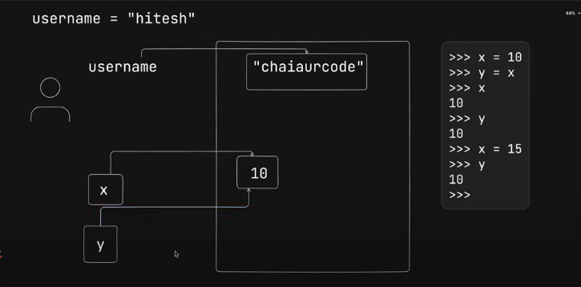
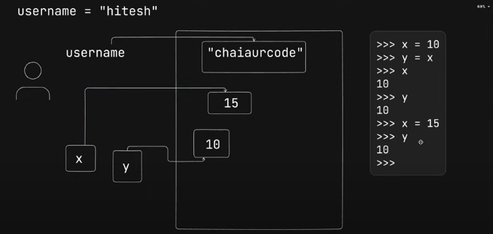
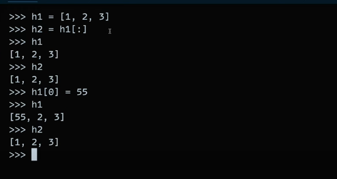

# Object Types / Data Types (Big Picture Overview)

- variables are also called as attributes
- Number : 1234, 3.1415, 3+4j, 0b111, Decimal(), Fraction()
- String : 'spam', "Bob's", b'a\x01c', u'sp\xc4m'
- List : [1, [2, 'three'], 4.5], list(range(10))
- Tuple : (1, 'spam', 4, 'U'), tuple('spam'), namedtuple
- Dictionary : {'food': 'spam', 'taste': 'yum'}, dict(hours=10)

- Set : set('abc'), {'a', 'b', 'c'}

- File : open('eggs.txt'), open(r'C:\ham.bin', 'wb')

- Boolean : True, False
- None : None
- Funtions, modules, classes

- Advance datatypes : Decorators, Generators, Iterators, MetaProgramming

- Note : Python treats number & strings in a different manner wrt others (list, dist, etc )

- Use dir(your_dataype) to know more about what you can do with the datatype

# Notes 

- In python everything is referenced as object

- Byte code is python specific instructions , not a machine code (means its not a intructions for machine like intel chip or hardware)

- python shell -> python + enter or open the file in integrated terminal & ctrl + delete for exit

- Mutable (that can be changed) --> List, set, dictionary, bytearray, array

- Immutable (that cannot be changed) --> Integers, floating-point-numbers, boolean, strings, tuples, frozen set, bytes

- example
- 
- 

- these will be called as objects when they are been reffered to a variable 

- data types are present in the memory, not the variable which is refferencing it

- means, memory ke ander jo bhi he uska datatype hota he & wo datatype memory ke ander hi assign hota he

- non refferend objects do not get free immediately (or no garbage collection immediately) (specially numbers and strings)

- 
    - in this case , when applied slicing , it just means we copied the object , means h1 has diff reference & h2 diff 