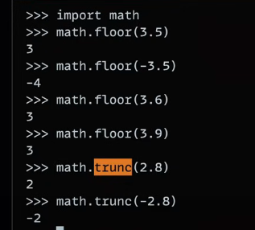
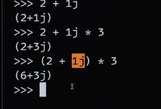
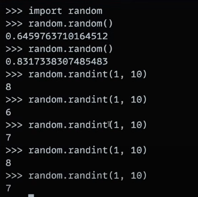
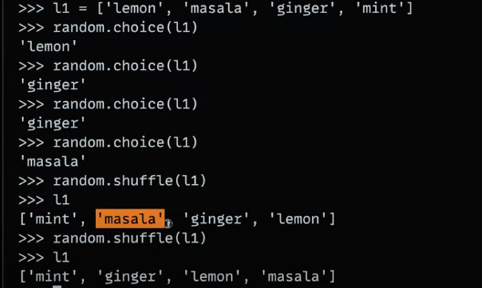
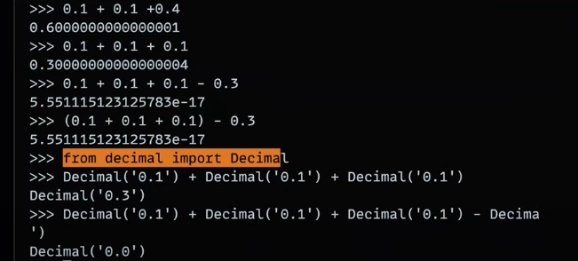
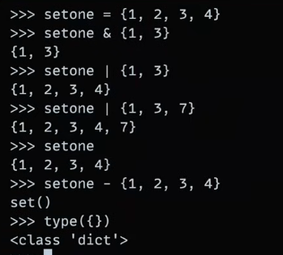

# NUMBERS

- in case of operations , always take same datatypes (eg , int * int)

- operator overloading :
    `
    "aditya" + "jaiswal" ->
    "adityajaiswal"
    `
- Math library (truck -> towards zero, )
 - 
 - 

## types of numbers
`
octal values : oct(64) ->
'0o100',
hexa values : hex(64) ->
'0x40',
binary values : bin(64) ->
'0b1000000',
int values : int(39.45) ->
39
`

## bitwise operators
`
x = 1
x << 2 (left shift)
4
`

## Sets
